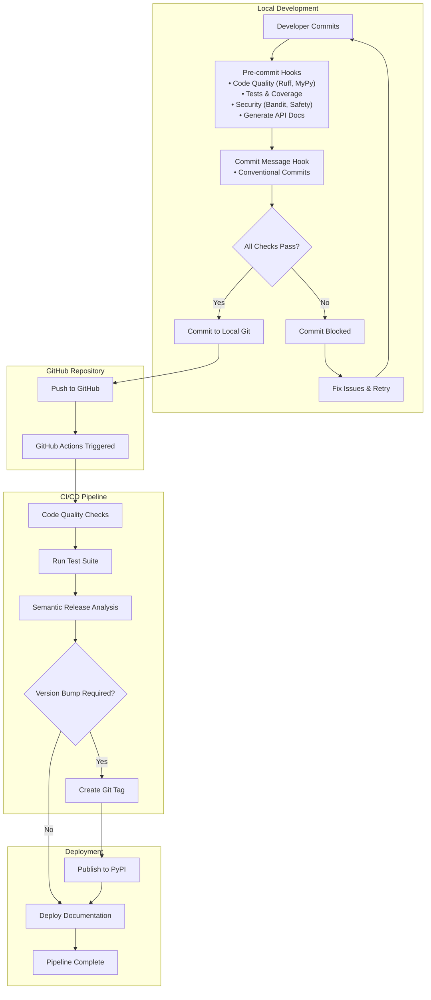

# CI/CD Pipeline

The CI/CD pipeline uses local pre-commit hooks to ensure code quality and GitHub Actions to automate releases. The workflow consists of two main stages:

* local development with quality gates to prevent problematic commits, and 
* automated deployment to handle versioning, package publishing and documentation deployment.

The following diagram illustrates this CI/CD pipeline:



## Pre-commit Hooks

Local quality gates that run before each commit with `fail_fast: true` - any failure blocks the commit.

### Code Quality Hooks

- **Ruff Check**: Linting with auto-fixes (`poetry run ruff check --fix`)
- **Ruff Format**: Code formatting (`poetry run ruff format`)
- **MyPy**: Type checking (`poetry run mypy --ignore-missing-imports`)

### Testing Hooks

- **Pytest**: Full test suite (`poetry run pytest`)
- **Doctest**: Validates docstring examples (`poetry run pytest --doctest-modules`)
- **Coverage**: Enforces 90% coverage threshold (`poetry run pytest --cov=src/ --cov-fail-under=90`)

### Security Hooks

- **Bandit**: Scans for security vulnerabilities (`poetry run bandit -r src/`)
- **Safety**: Checks dependencies for known vulnerabilities
- **Gitleaks**: Detects secrets and API keys

### Documentation Hook

- **Generate API Docs**: Auto-generates and stages API documentation based on google-style docstrings in `src/onesecondtrader`

### External Hooks

- **Conventional Commits**: Enforces commit message format (required for semantic-release)
- **File Validation**: YAML/TOML/JSON syntax, file size limits, merge conflicts

## Commit Message Conventions

This project follows [Conventional Commits](https://www.conventionalcommits.org/) specification for commit messages. This standardized format enables automated semantic versioning and changelog generation.

### Commit Message Format

```
<type>: <description>

[optional body]

[optional footer(s)]
```

### Commit Types

- **feat**: New features that add functionality
- **fix**: Bug fixes and patches
- **docs**: Documentation changes only
- **chore**: Maintenance tasks, dependency updates, build changes
- **test**: Adding or modifying tests
- **refactor**: Code changes that neither fix bugs nor add features
- **perf**: Performance improvements
- **ci**: Changes to CI/CD configuration

### Examples

```
feat: add portfolio optimization algorithm
fix: resolve division by zero in risk calculation
docs: update API reference for trading module
chore: bump pandas dependency to 2.3.1
test: add unit tests for backtesting engine
```

Commit messages are validated by the `conventional-pre-commit` hook, which blocks commits that don't follow this format.

## GitHub Actions Workflow

Automated CI/CD that triggers on every push to `master` branch.

### Workflow Steps

1. **Setup**: Checkout code with full Git history, install Python 3.11 and Poetry
2. **Dependencies**: Install project dependencies with `poetry install --with dev`
3. **Quality Checks**: Run Ruff linting, MyPy type checking, and pytest
4. **Git Config**: Configure bot identity for automated operations
5. **Semantic Release**: Analyze commits, bump version, create changelog, publish to PyPI
6. **Deploy Docs**: Deploy documentation to GitHub Pages

### Key Features

- **Semantic Versioning**: Uses conventional commits to determine version bumps
- **PyPI Publishing**: Automatically publishes new releases
- **Documentation**: Deploys to GitHub Pages on every release
- **Environment**: Requires `GITHUB_TOKEN` and `PYPI_API_TOKEN` secrets

## Setup Instructions

### GitHub Configuration

**Required Secrets** (`Settings > Secrets and variables > Actions`):
- `PYPI_API_TOKEN`: Generate from PyPI account settings

**Repository Settings**:
- **Actions**: Enable "Read and write permissions" and "Allow GitHub Actions to create and approve pull requests"
- **Pages**: Set source to "Deploy from a branch" using `gh-pages` branch

### Local Development Setup

**Install pre-commit hooks**:
```bash
poetry run pre-commit install
poetry run pre-commit install --hook-type commit-msg
```

**Test installation**:
```bash
poetry run pre-commit run --all-files
```

### Required Configuration

**pyproject.toml**:
```toml
[tool.semantic_release]
version_source = "tag"
upload_to_pypi = true
```

**mkdocs.yml** (key plugins):
```yaml
plugins:
  - mkdocstrings:
      handlers:
        python:
          options:
            docstring_style: google
```
