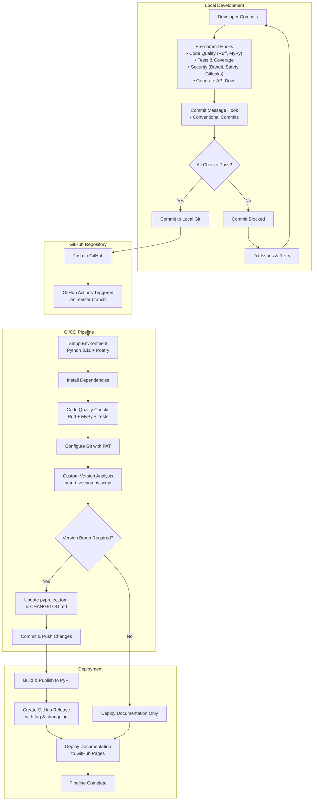

# CI/CD Pipeline

The CI/CD pipeline uses local pre-commit hooks to ensure code quality and GitHub Actions to automate releases. The workflow consists of two main stages:

* local development with quality gates to prevent problematic commits, and 
* automated deployment to handle versioning, package publishing and documentation deployment.

The following diagram illustrates this CI/CD pipeline:



## Pre-commit Hooks

Local quality gates that run before each commit with `fail_fast: true` - any failure blocks the commit.

### Code Quality Hooks

- **Ruff Check**: Linting with auto-fixes (`poetry run ruff check --fix`)
- **Ruff Format**: Code formatting (`poetry run ruff format`)
- **MyPy**: Type checking (`poetry run mypy src/`)

### Testing Hooks

- **Pytest**: Full test suite (`poetry run pytest`)
- **Doctest**: Validates docstring examples (`poetry run pytest --doctest-modules`)
- **Coverage**: Enforces 90% coverage threshold (`poetry run pytest --cov=src/ --cov-fail-under=90`)

### Security Hooks

- **Bandit**: Scans for security vulnerabilities (`poetry run bandit -r src/`)
- **Safety**: Checks dependencies for known vulnerabilities
- **Gitleaks**: Detects secrets and API keys

### Documentation Hook

- **Generate API Docs**: Auto-generates and stages API documentation based on google-style docstrings in `src/onesecondtrader`

### External Hooks

- **Conventional Commits**: Enforces commit message format (required for automated versioning)
- **Gitleaks**: Detects secrets and API keys in commits
- **File Validation**: YAML/TOML/JSON syntax, file size limits, merge conflicts, debug statements

## Commit Message Conventions

This project follows [Conventional Commits](https://www.conventionalcommits.org/) specification for commit messages. This standardized format enables automated semantic versioning and changelog generation.

### Commit Message Format

```
<type>: <description>

[optional body]

[optional footer(s)]
```

### Commit Types

- **feat**: New features that add functionality
- **fix**: Bug fixes and patches
- **docs**: Documentation changes only
- **chore**: Maintenance tasks, dependency updates, build changes
- **test**: Adding or modifying tests
- **refactor**: Code changes that neither fix bugs nor add features
- **perf**: Performance improvements
- **ci**: Changes to CI/CD configuration

### Examples

```
feat: add portfolio optimization algorithm
fix: resolve division by zero in risk calculation
docs: update API reference for trading module
chore: bump pandas dependency to 2.3.1
test: add unit tests for backtesting engine
```

Commit messages are validated by the `conventional-pre-commit` hook, which blocks commits that don't follow this format.

## GitHub Actions Workflow

Automated CI/CD that triggers on every push to `master` branch.

### Workflow Steps

1. **Setup**: Checkout code with full Git history (`fetch-depth: 0`), install Python 3.11 and Poetry
2. **Dependencies**: Install project dependencies with `poetry install --with dev`
3. **Quality Checks**: Run Ruff linting, MyPy type checking, and pytest
4. **Git Configuration**: Configure bot identity and PAT authentication for automated operations
5. **Version Analysis**: Custom script analyzes conventional commits to determine version bump
6. **Conditional Release**: If version bump required:
   - Update `pyproject.toml` and `CHANGELOG.md`
   - Commit and push changes
   - Build and publish to PyPI
   - Create GitHub release with tag and changelog
7. **Documentation**: Deploy to GitHub Pages using `mkdocs gh-deploy`

### Key Features

- **Custom Semantic Versioning**: Uses `scripts/bump_version.py` to analyze conventional commits
- **Conditional Publishing**: Only publishes when version bump is required
- **Automated Changelog**: Generates changelog from commit messages
- **GitHub Releases**: Creates releases with tags and changelog content
- **Documentation Deployment**: Always deploys docs, regardless of version changes
- **PAT Authentication**: Uses Personal Access Token for enhanced permissions

## Setup Instructions

### GitHub Configuration

**Required Secrets** (`Settings > Secrets and variables > Actions`):
- `GH_PAT`: Personal Access Token with enhanced permissions (see PAT Setup below)
- `PYPI_API_TOKEN`: Generate from PyPI account settings

**Repository Settings**:
- **Actions**: Enable "Read and write permissions" and "Allow GitHub Actions to create and approve pull requests"
- **Pages**: Set source to "Deploy from a branch" using `gh-pages` branch

### Personal Access Token (PAT) Setup

The workflow requires a Personal Access Token instead of the default `GITHUB_TOKEN` because it needs enhanced permissions to:
- Push commits back to the repository (version bumps and changelog updates)
- Create and manage GitHub releases
- Access repository metadata for version analysis

**Creating a PAT**:
1. Go to GitHub Settings > Developer settings > Personal access tokens > Tokens (classic)
2. Click "Generate new token (classic)"
3. Set expiration and select these scopes:
   - `repo` (Full control of private repositories)
   - `workflow` (Update GitHub Action workflows)
4. Copy the token and add it as `GH_PAT` secret in repository settings

**Why PAT is Required**:
The default `GITHUB_TOKEN` has limited permissions and cannot trigger subsequent workflow runs or push to protected branches. The PAT provides the necessary permissions for the automated release process.

### Local Development Setup

**Install pre-commit hooks**:
```bash
poetry run pre-commit install
poetry run pre-commit install --hook-type commit-msg
```

**Test installation**:
```bash
poetry run pre-commit run --all-files
```

### Required Configuration

**pyproject.toml** (version field):
```toml
[tool.poetry]
name = "onesecondtrader"
version = "0.1.0"  # Updated automatically by bump_version.py
```

**mkdocs.yml** (key plugins):
```yaml
plugins:
  - mkdocstrings:
      handlers:
        python:
          options:
            docstring_style: google
```

### Custom Scripts

**scripts/bump_version.py**:
- Analyzes conventional commit messages since last tag
- Determines semantic version bump (major/minor/patch)
- Updates `pyproject.toml` version and generates `CHANGELOG.md`
- Returns new version for GitHub Actions workflow

**scripts/generate_api_docs.py**:
- Auto-generates API documentation from source code
- Creates individual module pages and overview
- Updates `mkdocs.yml` navigation structure
- Runs as pre-commit hook to keep docs synchronized

## Troubleshooting

### Common Issues

**Permission Denied Errors**:
- Ensure `GH_PAT` secret is properly configured with correct scopes
- Verify repository Actions permissions allow write access
- Check that PAT hasn't expired

**Version Not Bumping**:
- Ensure commits follow conventional commit format
- Check that there are new commits since the last tag
- Verify `bump_version.py` script can read Git history

**Documentation Deployment Fails**:
- Ensure `gh-pages` branch exists and is configured in repository settings
- Check that `mkdocs.yml` configuration is valid
- Verify all documentation dependencies are installed

**PyPI Publishing Fails**:
- Verify `PYPI_API_TOKEN` is valid and has upload permissions
- Check that package name is available on PyPI
- Ensure `pyproject.toml` has correct package metadata

### Workflow Permissions

The workflow requires specific permissions that exceed the default `GITHUB_TOKEN` capabilities:

- **Repository Write**: To push version bump commits
- **Contents Write**: To create and update files
- **Actions Write**: To trigger subsequent workflows
- **Pull Requests Write**: For automated PR operations
- **Metadata Read**: To access repository information

These enhanced permissions are why a Personal Access Token (PAT) is required instead of the default token.
