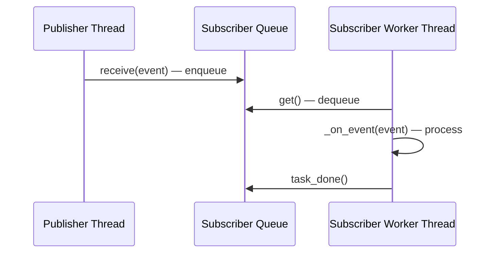
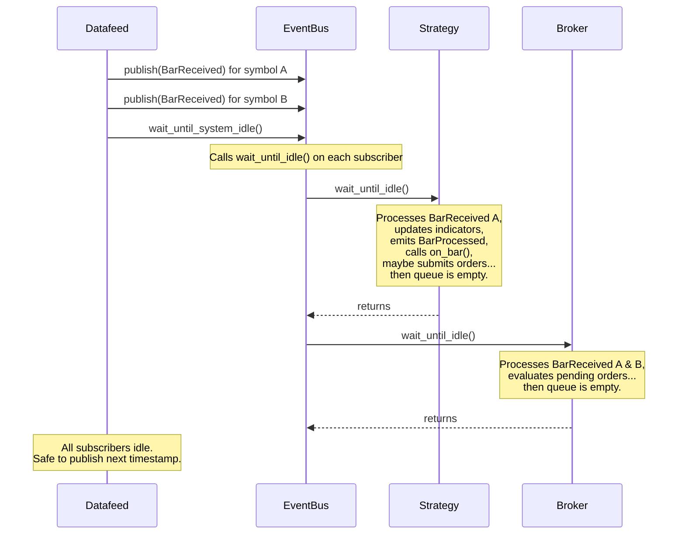

# Event-Driven Architecture

This page explains the foundational design decision behind OneSecondTrader: why the system is event-driven, how the EventBus works, and what consequences this has for threading, testing, and backtest determinism.

## Why Event-Driven?

A trading system has many components that need to react to the same data. When a new market bar arrives, the broker needs to evaluate pending orders against it, every strategy needs to update its indicators and run its logic, and the run recorder needs to persist the bar to the database. When a strategy submits an order, the broker must process it, and the recorder must log it.

There are several ways to wire these components together:

| Approach | How it works | Drawback |
|---|---|---|
| **Direct calls** | Strategy calls `broker.submit(order)` | Every component must know about every other component. Adding a recorder means modifying the strategy. |
| **Callbacks** | Components register callback functions | Callback order is fragile and hard to reason about. Deeply nested callbacks create tangled control flow. |
| **Polling** | Components periodically check for new data | Wastes resources and introduces latency. Ordering between components is non-deterministic. |
| **Publish-subscribe** | Components publish events to a bus; interested components subscribe | Components are decoupled. New subscribers (like a recorder) can be added without modifying publishers. |

OneSecondTrader uses **publish-subscribe**. Each component only knows about the EventBus and the event types it cares about. A strategy never calls the broker directly --- it publishes an `OrderSubmissionRequest` event, and the broker, which has subscribed to that event type, receives and processes it independently. This has three practical consequences:

1. **Loose coupling.** Adding a new subscriber (like a logger or a risk monitor) requires zero changes to existing components.
2. **Testability.** Any component can be tested in isolation by injecting events into its queue and inspecting what it publishes.
3. **Backtest/live portability.** Because a strategy only interacts with events, not with a concrete broker implementation, the same strategy code runs unchanged in both backtest and live environments.

## The EventBus

The `EventBus` is the central dispatch mechanism. It maintains a mapping from each concrete event type to the set of subscribers interested in that type.

!!! info "Design Decision: Exact-Type Dispatch"

    When an event is published, the EventBus matches subscribers based on the **exact concrete type** of the event. Inheritance relationships are not considered. If a subscriber registers for `EventBase`, it will *not* receive `BarReceived` events --- only events whose type is literally `EventBase`.

    This makes dispatch predictable. You always know exactly which event type will trigger which subscriber, without needing to reason about class hierarchies.

Publishing works in two steps:

1. **Snapshot the subscriber set** under the lock (a copy, so the lock is not held during delivery).
2. **Deliver the event** to each subscriber by calling `subscriber.receive(event)`.

```python
def publish(self, event: EventBase) -> None:
    with self._lock:
        subscribers = self._per_event_subscriptions[type(event)].copy()  # (1)!
    for subscriber in subscribers:
        subscriber.receive(event)  # (2)!
```

1. The subscriber set is copied while holding the lock. This ensures that subscription changes during delivery do not cause errors.
2. Delivery happens outside the lock. Each subscriber's `receive` method simply enqueues the event, so this call is fast and non-blocking.

This design means that the *publisher's* thread performs the dispatch, but actual event *processing* happens in each subscriber's own thread.

[:material-link-variant: View EventBus API Reference](../reference/messaging/eventbus.md)

## Subscribers and Threading

Every component that needs to react to events extends `Subscriber`. Each subscriber gets its own **dedicated worker thread** and an **unbounded queue**.



When the EventBus calls `subscriber.receive(event)`, the event is placed into the subscriber's queue and the publisher's thread returns immediately. The subscriber's worker thread picks events off the queue one at a time and calls `_on_event()` for each.

!!! info "Design Decision: One Thread Per Subscriber"

    Each subscriber has its own thread and queue. This provides two guarantees:

    - **Isolation.** A slow subscriber (e.g., one running a complex computation) cannot block other subscribers from receiving events.
    - **Deterministic ordering.** Within a single subscriber, events are always processed in the order they were published. There is no interleaving.

    The trade-off is thread count: a system with *N* subscribers has *N* worker threads plus the threads used by the datafeed and the EventBus dispatch. In practice, a typical run has a handful of subscribers (one broker, one or a few strategies, one recorder), so this is not a concern.

The worker thread runs a simple loop:

```python
def _event_loop(self) -> None:
    while True:
        event = self._queue.get()

        if event is None:  # (1)!
            self._queue.task_done()
            break

        try:
            self._on_event(event)
        except Exception as exc:
            self._on_exception(exc)  # (2)!
        finally:
            self._queue.task_done()  # (3)!

    self._cleanup()
```

1. A `None` sentinel signals the thread to stop. This is enqueued during `shutdown()`.
2. Exceptions in event handling are caught and forwarded to `_on_exception()`. The thread continues processing the next event rather than dying.
3. `task_done()` is always called, even if processing raises an exception. This is critical for `wait_until_idle()` to work correctly.

[:material-link-variant: View Subscriber API Reference](../reference/messaging/subscriber.md)

## The Idle-Wait Protocol

In a live trading system, events arrive continuously from external sources and components run at their own pace. But in a backtest, the system controls time: it replays historical bars one timestamp at a time and needs every component to finish processing the current timestamp before moving to the next. Without this guarantee, a fast-publishing datafeed could flood subscribers with bars from different timestamps before they finish processing earlier ones.

The idle-wait protocol solves this. After the datafeed publishes all bars for a given timestamp, it calls `event_bus.wait_until_system_idle()`. This method iterates over every registered subscriber and calls `subscriber.wait_until_idle()`, which blocks until the subscriber's queue is empty (using Python's `queue.Queue.join()`).



!!! info "Design Decision: System-Wide Barrier"

    The idle-wait is effectively a **barrier synchronization** between timestamps. This is what makes backtesting deterministic: every subscriber sees and fully processes all bars from timestamp *T* before any bar from timestamp *T+1* is published.

    The trade-off is performance. In a backtest, the datafeed must wait for the slowest subscriber after every timestamp. This is an inherent cost of determinism. In live trading, this protocol is not used --- events flow continuously.

??? example "Why ordering matters: an example"

    Consider a strategy that submits a market order when it sees a bar. The order must be filled on the *next* bar, not the current one (the current bar's prices are already in the past by the time the strategy reacts).

    With idle-wait:

    1. Datafeed publishes bars for timestamp *T*.
    2. System waits until idle.
    3. Strategy processes bar *T*, submits a market order.
    4. Datafeed publishes bars for timestamp *T+1*.
    5. Broker processes bar *T+1*, fills the market order at the open price.

    Without idle-wait, the broker might receive bar *T+1* before the strategy has even finished processing bar *T*, leading to incorrect fill timing.

## Events as Immutable Data

Every event in the system is a frozen dataclass with `slots=True`:

```python
@dataclasses.dataclass(kw_only=True, frozen=True, slots=True)
class EventBase:
    ts_event_ns: int
    ts_created_ns: int = dataclasses.field(default_factory=time.time_ns)
```

!!! info "Design Decision: Frozen Dataclasses"

    Events are **immutable** (frozen). Once created, no field can be changed. This is essential in a multi-threaded system: the same event object is delivered to multiple subscribers across different threads. If any subscriber could mutate the event, other subscribers would see unpredictable state.

    `slots=True` is a performance optimization that avoids per-instance `__dict__` overhead.

Every event carries two nanosecond-precision timestamps:

| Timestamp | Meaning |
|---|---|
| `ts_event_ns` | When the fact represented by the event occurred. For a market bar, this is the bar's observation time. For an order fill, this is the simulated fill time. |
| `ts_created_ns` | When the Python event object was instantiated. Auto-populated via `time.time_ns()`. |

In backtesting, `ts_event_ns` comes from the historical data (simulated time), while `ts_created_ns` reflects wall-clock time. In live trading, both timestamps are close to each other. The separation allows the system to distinguish between "when did this happen in market time?" and "when did the system become aware of it?"

[:material-link-variant: View EventBase API Reference](../reference/events/base.md)
