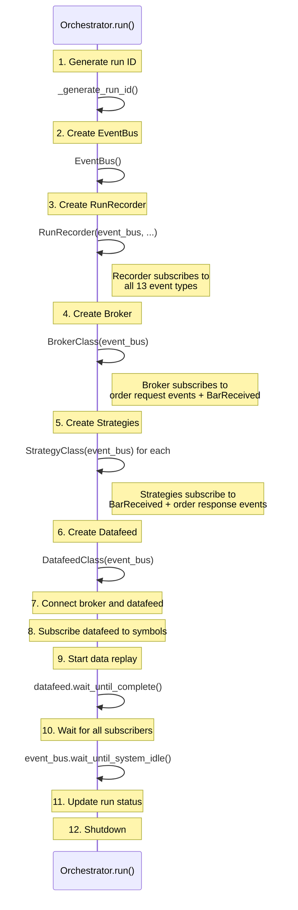

# Orchestration and Recording

This page explains how a trading run is assembled from component classes, executed through the event-driven lifecycle, persisted to a database, and how the dashboard integrates with this machinery.

## The Orchestrator's Role

The `Orchestrator` is the entry point for a trading run. It takes **classes** (not instances) for the strategies, broker, and datafeed, and handles the entire lifecycle: creating all components, wiring them together via a shared EventBus, coordinating execution, and shutting everything down.

```python
orchestrator = Orchestrator(
    strategies=[SMACrossover],       # classes, not instances
    broker=SimulatedBroker,
    datafeed=SimulatedDatafeed,
)
orchestrator.run()
```

!!! info "Design Decision: Classes, Not Instances"

    The orchestrator takes classes rather than pre-built instances. This allows it to control the order of construction --- which matters because all components need the same `EventBus` instance, and the recorder must subscribe before any events are published.

    It also enables the class-attribute configuration pattern: strategies, brokers, and datafeeds store their configuration as class attributes (e.g., `SimulatedDatafeed.publisher_name`, `SimulatedBroker.commission_per_unit`). The orchestrator creates instances from these configured classes.

[:material-link-variant: View Orchestrator API Reference](../reference/orchestrator/orchestrator.md)

## Run Assembly

Component creation follows a strict order. Each step depends on the previous ones:



!!! info "Design Decision: Why Creation Order Matters"

    The **RunRecorder** is created first (after the EventBus) because it must be subscribed to all event types before any other component publishes events. If the broker were created first, its subscription acknowledgment events could fire before the recorder is listening.

    The **Datafeed** is created last because it should not start publishing bars until the broker and strategies are ready to receive them. Although publishing only begins when `wait_until_complete()` is called, creating the datafeed last keeps the construction sequence clean.

The run ID is generated as `{timestamp}_{strategy_names}` (e.g., `2025-01-15_14-30-00_SMA Crossover`), providing a human-readable identifier that is also unique due to the timestamp.

## The RunRecorder

The `RunRecorder` is a `Subscriber` that persists every event to a SQLite database. It subscribes to all 13 event types in the system:

| Category | Event Types |
|---|---|
| Market data | `BarReceived`, `BarProcessed` |
| Order requests | `OrderSubmissionRequest`, `OrderCancellationRequest`, `OrderModificationRequest` |
| Broker responses | `OrderAccepted`, `OrderRejected`, `CancellationAccepted`, `CancellationRejected`, `ModificationAccepted`, `ModificationRejected` |
| Order outcomes | `FillEvent`, `OrderExpired` |

Each event type maps to a separate database table with columns matching the event's fields.

### Buffered Batch Inserts

Writing every event individually to SQLite would be slow. The recorder uses a buffering strategy:

```python
BATCH_SIZE = 1000

def _buffer_bar_received(self, event: BarReceived) -> None:
    self._buffers["bars"].append((
        self._run_id,
        event.ts_event_ns,
        event.ts_created_ns,
        event.symbol,
        event.bar_period.name,
        event.open, event.high, event.low, event.close,
        event.volume,
    ))
    if len(self._buffers["bars"]) >= BATCH_SIZE:  # (1)!
        self._flush_bars()
```

1. When the buffer reaches 1,000 records, it is flushed to the database in a single `executemany()` call followed by a `commit()`. This reduces the number of disk writes by three orders of magnitude compared to per-event inserts.

The recorder maintains 13 independent buffers (one per event type). On shutdown, the `_cleanup()` method flushes all remaining buffered records before closing the database connection.

!!! info "Design Decision: Two Databases"

    The system uses two separate SQLite databases:

    - **`secmaster.db`** --- The source data. Contains historical OHLCV bars, instrument metadata, and symbology mappings. Read by the `SimulatedDatafeed`.
    - **`runs.db`** --- The results. Contains run metadata, recorded events, fills, and indicator values. Written by the `RunRecorder`, read by the dashboard.

    This separation keeps source data immutable. Runs can be deleted without affecting the historical data, and the secmaster can be updated without affecting past run results.

### Database Configuration

Both databases use the same SQLite pragmas for performance and concurrency:

- **WAL journal mode** --- Allows concurrent reads while writing. The dashboard can read run results while a backtest is still recording events.
- **Foreign keys enabled** --- Ensures referential integrity between the `runs` table and event tables.
- **`check_same_thread=False`** --- Required because the recorder's database connection is opened in one thread (the constructor) but used in another (the subscriber's worker thread).

[:material-link-variant: View RunRecorder API Reference](../reference/orchestrator/run_recorder.md)

## Shutdown Sequence

When the datafeed finishes replaying all bars, the orchestrator shuts down components in **reverse dependency order**:

```python
def _shutdown(self) -> None:
    if self._datafeed:
        self._datafeed.disconnect()       # 1. Stop data source
    if self._broker:
        self._broker.disconnect()         # 2. Stop order processing
    for strategy in self._strategies:
        strategy.shutdown()               # 3. Stop strategies
    if self._recorder:
        self._recorder.shutdown()         # 4. Flush and stop recording
```

!!! info "Design Decision: Why Shutdown Order Matters"

    The datafeed is disconnected first because it is the source of events that drive the entire system. Disconnecting it ensures no new `BarReceived` events are published.

    The broker is disconnected next. At this point, no new bars are arriving, so no new fills will be generated.

    Strategies are shut down after the broker, ensuring they have received all pending fill events and order responses before stopping.

    The recorder is shut down **last**. This is critical: it must remain subscribed until all other components have finished publishing events. The `shutdown()` call triggers the subscriber's `_cleanup()` method, which flushes all remaining buffered records to the database.

Before shutdown begins, the orchestrator calls `event_bus.wait_until_system_idle()` one final time to ensure all subscribers have processed their queues. The run status is then updated to `"completed"` (or `"failed"` if an exception occurred).

## Dashboard Integration

The dashboard runs backtests by dynamically creating configured subclasses of the strategy, datafeed, and orchestrator using Python's built-in `type()` function:

```python
# Create a configured strategy subclass with user-selected parameters
configured_strategy = type(
    f"_Configured{request.strategy}",   # (1)!
    (strategy_cls,),                    # (2)!
    {"symbols": request.symbols, "parameters": updated_parameters},
)
```

1. The class name is prefixed with `_` so it is excluded from the auto-registration registry (recall the `__init_subclass__` convention from [Indicator Model](indicator_model.md#auto-registration-via-__init_subclass__)).
2. The new class inherits from the original strategy class, overriding only the `symbols` and `parameters` class attributes with values from the dashboard form.

The same pattern is used for the datafeed and orchestrator:

```python
configured_datafeed = type(
    "ConfiguredDatafeed",
    (SimulatedDatafeed,),
    datafeed_attrs,  # db_path, publisher_name, dataset, etc.
)
```

!!! info "Design Decision: Dynamic Subclasses via `type()`"

    This approach works because the entire system uses class-attribute configuration. The orchestrator takes classes and reads their class attributes. By creating subclasses with overridden attributes, the dashboard can configure any run without modifying the original classes or requiring a separate configuration file format.

    The leading-underscore prefix on configured strategy subclasses (`_ConfiguredSMACrossover`) prevents them from appearing in the strategy registry, which would pollute the dashboard's strategy dropdown with ephemeral run-specific entries.
