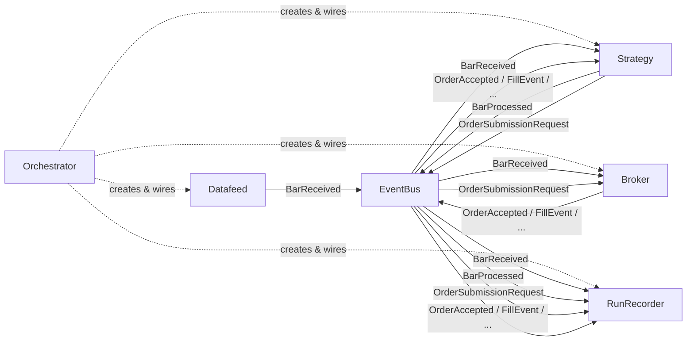

---
hide:
#  - navigation
#  - toc
---

# Explanation

## What This Section Covers

The pages in this section are **understanding-oriented**. They explain *why* OneSecondTrader is designed the way it is, discuss the trade-offs behind key decisions, and build mental models for how the pieces fit together.

You will not find step-by-step instructions here (those belong in [Tutorials](../tutorials/getting_started.md)) or exhaustive API listings (those belong in [Reference](../reference/overview.md)). Instead, these pages answer questions like:

- Why is the system event-driven rather than using direct function calls?
- Why does each indicator produce exactly one number per bar?
- How does the same strategy code run in both backtest and live environments?

## System at a Glance

The diagram below shows the major components and how events flow between them during a trading run.

Every component communicates through the **EventBus** using immutable event objects. The Orchestrator assembles all components at the start of a run and tears them down when it finishes. The RunRecorder subscribes to every event type and persists the full history to a SQLite database.

## Reading Guide

The pages below are arranged in recommended reading order. Each one builds on concepts introduced in the previous pages.

-   __Event-Driven Architecture__

    ---

    The foundational design decision. Explains why the system uses publish-subscribe, how the EventBus dispatches events, the threading model, and how idle-wait synchronization makes backtesting deterministic.

    [:material-link-variant: Read more](event_driven_architecture.md)

-   __Indicator Model__

    ---

    Why each indicator produces exactly one scalar value per bar, how per-symbol state isolation works, the auto-registration mechanism, and how plotting metadata is encoded.

    [:material-link-variant: Read more](indicator_model.md)

-   __Strategy Lifecycle__

    ---

    How strategies subscribe to events, the bar processing pipeline from raw data to indicator values to trading logic, order lifecycle tracking, and position management.

    [:material-link-variant: Read more](strategy_lifecycle.md)

-   __Broker and Datafeed__

    ---

    The abstraction that makes strategy code portable between backtest and live environments. Covers simulated fill models, datafeed replay, and what changes when going live.

    [:material-link-variant: Read more](broker_and_datafeed.md)

-   __Orchestration and Recording__

    ---

    How a trading run is assembled, executed, and persisted. Covers component creation order, the shutdown sequence, buffered database recording, and dashboard integration.

    [:material-link-variant: Read more](orchestration_and_recording.md)

