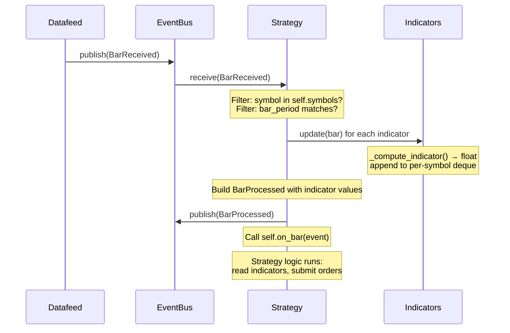
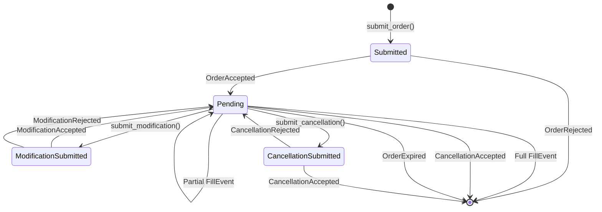

# Strategy Lifecycle

This page explains how strategies fit into the event-driven architecture, the bar processing pipeline from raw data to trading decisions, how orders flow through the system, and how positions are tracked.

## Strategy as Subscriber

A strategy is a `Subscriber`. It has its own worker thread, its own event queue, and processes events sequentially. It never calls the broker directly --- instead, it publishes order request events to the EventBus and receives order response events asynchronously.

This separation is what makes strategy code portable between backtest and live environments. The strategy has no knowledge of *who* processes its order requests. In backtesting, a `SimulatedBroker` picks them up. In live trading, a live broker adapter does. The strategy code is identical in both cases.

A strategy subscribes to nine event types during initialization:

| Event Type | Purpose |
|---|---|
| `BarReceived` | Incoming market data |
| `OrderAccepted` | Broker accepted an order submission |
| `OrderRejected` | Broker rejected an order submission |
| `ModificationAccepted` | Broker accepted an order modification |
| `ModificationRejected` | Broker rejected an order modification |
| `CancellationAccepted` | Broker accepted an order cancellation |
| `CancellationRejected` | Broker rejected an order cancellation |
| `FillEvent` | An order was (partially or fully) filled |
| `OrderExpired` | An order expired |

[:material-link-variant: View StrategyBase API Reference](../reference/strategies/base.md)

## The Bar Processing Pipeline

When a `BarReceived` event arrives, the strategy processes it through a fixed pipeline:



The steps in detail:

1. **Symbol and period filtering.** The strategy checks that the bar is for one of its configured `symbols` and matches its `bar_period`. Bars for other symbols or periods are silently ignored.

2. **Set active context.** `_current_symbol` and `_current_ts` are updated. These determine which symbol `self.position` returns the position for and which symbol `submit_order()` targets.

3. **Update all indicators.** Each indicator registered via `add_indicator()` is called with `ind.update(bar)`. This runs the indicator's computation and appends the result to its per-symbol history buffer.

4. **Emit `BarProcessed`.** The strategy constructs a `BarProcessed` event containing the original OHLCV data plus a dictionary of all indicator values (with encoded plotting metadata as keys). This event is published to the EventBus, where the RunRecorder persists it.

5. **Call `on_bar()`.** The strategy's user-defined trading logic runs. At this point, all indicator values are up-to-date and accessible.

!!! info "Design Decision: Why This Order Matters"

    Indicators are updated *before* `on_bar()` is called. This guarantees that when your strategy reads `self.fast_sma.latest(symbol)`, it sees the value computed from the current bar, not the previous one.

    `BarProcessed` is emitted *before* `on_bar()` as well. This means the recorded indicator values reflect the state at the time the strategy made its decisions, regardless of whether `on_bar()` modifies any state.

## The Order Lifecycle

When a strategy calls `submit_order()`, it does not directly interact with the broker. Instead, it publishes an `OrderSubmissionRequest` event and tracks the order internally. The order then moves through a state machine as the broker responds:



The strategy tracks orders across four dictionaries, each representing a different state:

| Dictionary | State | Contents |
|---|---|---|
| `_submitted_orders` | Submitted, awaiting broker acknowledgment | Orders that `submit_order()` has published but the broker has not yet accepted or rejected. |
| `_pending_orders` | Accepted by broker, awaiting fill/cancel/expiry | Orders the broker has acknowledged. These are "live" orders. |
| `_submitted_modifications` | Modification submitted, awaiting response | Modified versions of pending orders, awaiting broker acknowledgment. |
| `_submitted_cancellations` | Cancellation submitted, awaiting response | Pending orders with cancellation requests in flight. |

!!! info "Design Decision: Multiple Dictionaries"

    Why not a single dictionary with a status field? Because the dictionaries serve as *type-safe state partitions*. An order in `_submitted_orders` can only transition to `_pending_orders` (via `OrderAccepted`) or be removed (via `OrderRejected`). The code that handles `OrderAccepted` only needs to look in `_submitted_orders` --- it does not need to check a status field or guard against impossible transitions.

    This also means there is no risk of accidentally operating on an order in the wrong state. `submit_modification()` only succeeds if the order is in `_pending_orders`.

## Position Tracking

The strategy maintains per-symbol position quantities and average entry prices:

```python
self._positions: dict[str, float] = {}   # signed quantity (+long, -short)
self._avg_prices: dict[str, float] = {}  # weighted average entry price
```

When a fill event arrives, the `_update_position()` method updates these values. The logic handles four cases:

1. **Entering a new position** (old position is zero): average price is the fill price.
2. **Adding to an existing position** (same direction): average price is the weighted average of the old position and the new fill.
3. **Reducing a position** (opposite direction, not flipping): average price stays the same --- only the quantity decreases.
4. **Flipping a position** (opposite direction, new position exceeds old): average price resets to the fill price for the new direction.
5. **Closing a position** (new position is exactly zero): average price resets to zero.

!!! note "Multi-Symbol Caveat: `self.position` Scoping"

    `self.position` returns the position for the **active symbol** --- the symbol of the most recently processed bar. In a multi-symbol strategy, this is the correct behavior during `on_bar()`, because you are making decisions about the symbol whose bar just arrived.

    However, if you need to check positions for *other* symbols (e.g., to implement cross-symbol logic), access `self._positions[symbol]` directly.

## OHLCV as Indicators

During initialization, the strategy creates five built-in indicators for the raw OHLCV bar fields:

```python
self.bar = SimpleNamespace(
    open=self.add_indicator(indicators.Open()),
    high=self.add_indicator(indicators.High()),
    low=self.add_indicator(indicators.Low()),
    close=self.add_indicator(indicators.Close()),
    volume=self.add_indicator(indicators.Volume()),
)
```

These are full `IndicatorBase` instances --- they compute and store per-symbol history just like any other indicator. This means you can access historical bar data through the same interface as computed indicators:

```python
# Current bar's close price (from the BarReceived event):
event.close

# Previous bar's close price (from the indicator history):
self.bar.close[symbol, -2]

# Close price from 5 bars ago:
self.bar.close[symbol, -6]
```

!!! info "Design Decision: Unified Access Pattern"

    By wrapping OHLCV fields as indicators, the strategy has a single, consistent way to access both raw prices and computed values. There is no separate "bar history" API --- everything goes through the indicator's `__getitem__` interface with `(symbol, index)` tuples.

    This is particularly useful in multi-symbol strategies where you need historical prices for a specific symbol. Without this, you would need a separate per-symbol bar buffer.

## ParamSpec and Parameter Sweeping

Strategy parameters are declared as class attributes using `ParamSpec`:

```python
class SMACrossover(StrategyBase):
    name = "SMA Crossover"
    parameters = {
        "bar_period": ParamSpec(default=models.BarPeriod.SECOND),
        "fast_period": ParamSpec(default=20, min=5, max=100, step=1),
        "slow_period": ParamSpec(default=100, min=10, max=500, step=1),
        "quantity": ParamSpec(default=1.0, min=0.1, max=100.0, step=0.1),
    }
```

!!! info "Design Decision: Class Attributes, Not `__init__` Arguments"

    Parameters are defined as a class-level dictionary rather than `__init__` arguments. This design serves the dashboard: the dashboard can inspect the `parameters` dictionary *without instantiating the strategy* to render input controls (sliders for numeric params with `min`/`max`/`step`, dropdowns for params with `choices` or enum defaults).

    At instantiation time, the base class `__init__` resolves each parameter:

    ```python
    for name, spec in self.parameters.items():
        value = overrides.get(name, spec.default)
        setattr(self, name, value)
    ```

    This sets `self.fast_period = 20` (or whatever override was passed). The strategy code then accesses `self.fast_period` as a plain attribute. The `setup()` hook runs after parameter resolution, so indicators can use the resolved values (e.g., `SimpleMovingAverage(period=self.fast_period)`).

The `setup()` hook avoids the need to override `__init__`. Subclasses register their indicators in `setup()`, which is called at the end of `__init__` after parameters have been resolved and OHLCV indicators have been created:

```python
def setup(self) -> None:
    self.fast_sma = self.add_indicator(
        indicators.SimpleMovingAverage(period=self.fast_period, plot_at=0)
    )
    self.slow_sma = self.add_indicator(
        indicators.SimpleMovingAverage(period=self.slow_period, plot_at=0)
    )
```

[:material-link-variant: View StrategyBase API Reference](../reference/strategies/base.md)
