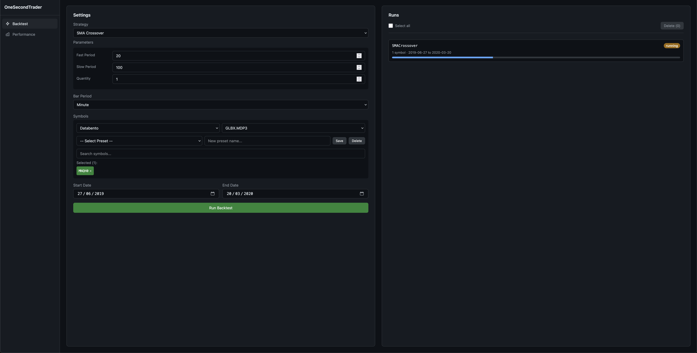
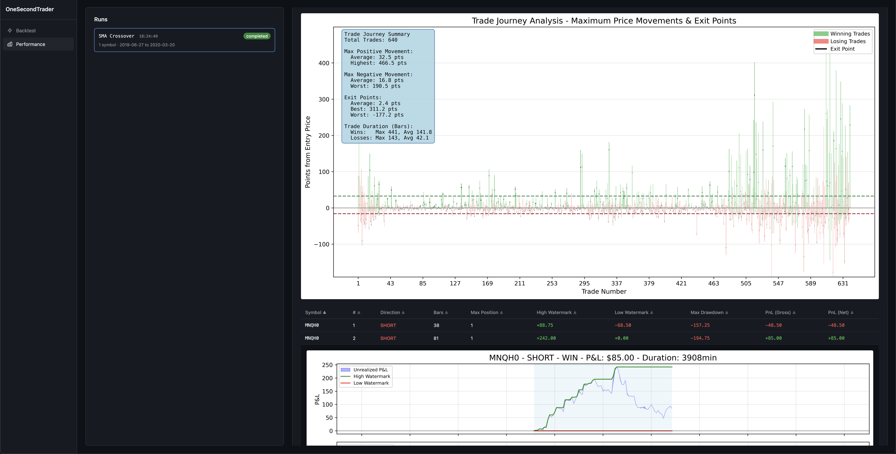

# Getting Started 


This guide will teach you how to develop indicators, design strategies, and run backtests using OneSecondTrader. 


## Installation


=== "Pip"
    
    **Step 0**

    Make sure that pip is installed. If not, install it by following the [:material-link-variant:Official Documentation](https://pip.pypa.io/en/stable/installation/).

    **Step 1**

    Navigate to the folder you want to use or create a new one. Then run the following comand inside this folder to create a virtual environment:

    ```bash 
    python3 -m venv .venv
    source .venv/bin/activate
    ```

    **Step 2**

    Install OneSecondTrader by running the following command:

    ```bash
    pip install onesecondtrader
    ```


=== "Poetry"

    **Step 0**

    Make sure that poetry is installed. If not, install it by following the [:material-link-variant:Official Documentation](https://python-poetry.org/docs/#installation).

    **Step 1**

    Navigate to the folder you want to use or create a new one. Then run the following comand inside this folder:

    ```bash
    poetry init
    ```

    **Step 2**

    Add `package-mode = false` to your `pyproject.toml` file. It should look similar to this:
 
    ``` toml linenums="1" hl_lines="9 10"
    [project]
    name = "stratdev"
    version = "0.1.0"
    description = ""
    authors = [
        {name = "Nils P. Kujath",email = "63961429+NilsKujath@users.noreply.github.com"}
    ]

    [tool.poetry]
    package-mode = false


    [tool.poetry.dependencies]
    python = ">=3.11,<4.0"
    onesecondtrader = "^0.61.0"


    [build-system]
    requires = ["poetry-core>=2.0.0,<3.0.0"]
    build-backend = "poetry.core.masonry.api"
    ```

    **Step 3**

    Install OneSecondTrader by running the following command:

    ```bash
    poetry add onesecondtrader
    ```

    **Step 4**

    Activate the virtual environment by running the following command:

    ```bash
    poetry env activate
    ```

## Historical Market Data

Running backtests requires historical market data.
For serious work, we recommend using a data provider like Databento.

=== "Databento"

    **Step 0**

    Assuming you already have a Databento account, download the data you want to use for backtesting in `.dbn` format and `.zst` compression (note that it does not matter how you choose to split the files).
    For more information, see the [:material-link-variant:Databento Documentation](https://databento.com/docs).
    You should receive a .zip file that contains a `.dbn` file(s) and some metadata `.json` files (importantly, `symbology.json`).


    **Step 1**

    Start an interactive Python session (`poetry run python` if you use poetry, `python` or `python3` if you are using venv) and run the following commands to create an empty securities master database:

    ```python
    from onesecondtrader import secmaster
    from pathlib import Path
    secmaster.create_secmaster_db(Path("secmaster.db"))
    ```

    **Step 2**

    Still in an interactive Python session, run the following commands to ingest the data into the database:

    ```python
    secmaster.ingest_databento_zip(Path("path/to/your/download.zip"), Path("./secmaster.db"))
    ```

    This may take a while. After it's done, you can exit the interactive Python session (`exit()`).

    **Step 3**

    Set the `SECMASTER_DB_PATH` environment variable to the path of the database you just created.
    You can do this by running the following command (this is not necessary if you are running the dashboard from the same directory as the database):

    === "macOS / Linux"

        ```bash
        export SECMASTER_DB_PATH=/path/to/your/secmaster.db
        ```

    === "Windows (PowerShell)"

        ```powershell
        $env:SECMASTER_DB_PATH = "C:\path\to\your\secmaster.db"
        ```

    === "Windows (CMD)"

        ```cmd
        set SECMASTER_DB_PATH=C:\path\to\your\secmaster.db
        ```

    
=== "Other Providers"

    !!! warning "Coming Soon"

        Other providers will be supported soon. If you want to contribute, please open an issue or submit a pull request.


## Exploring the Dashboard

Now it is time to explore the dashboard.
It will allow you to run backtests and analyze performance metrics.
The OneSecondTrader package provides a simple SMA crossover strategy that you will backtest to acquaint yourself with the dashboard.
Afterward, you will learn how to create your own indicators and strategies and backtest them via the dashboard.

**Step 0**

Start the dashboard server:

=== "Pip"

    ```bash
    onesecondtrader
    ```

=== "Poetry"

    ```bash
    poetry run onesecondtrader
    ```

Open your browser and navigate to [http://127.0.0.1:8001](http://127.0.0.1:8001).


**Step 1**

Once the dashboard is up and running, you should see the following page:


Now select the strategy (recommended: `SMA Crossover` for demonstration purposes) and optionally tweak the parameters.
Then select the bar period (the shown options depend on the data you have ingested) and the publisher and dataset (again, you will only see what you have ingested).

Then select a symbol (or symbols) and set the date range.


**Step 2**

Click `Run Backtest` and wait for it to finish.



You can then click on the run once it is completed to view the performance metrics and charts.
This will guide you to the performance page.
You can also access the performance page by clicking on the `Performance` link in the sidebar.
Once a run is selected, you will be shown the performance metrics for that run.
If you click on a specific trade in the table, you will be shown a chart of that trade.
To view per-trade performance metrics, you will need to select the symbol first via the search bar above the table.




## Developing Indicators

Now it is time to develop your first indicator.


**Step 0**

It is advisable to familiarize yourself with how OneSecondTrader works under the hood.
I recommend that you take a look at (at least) the following packages and their source code:

- [`onesecondtrader.models`](../reference/overview.md)
- [`onesecondtrader.events`](../reference/overview.md)
- [`onesecondtrader.messaging`](../reference/overview.md)
- [`onesecondtrader.indicators`](../reference/overview.md)
- [`onesecondtrader.strategies`](../reference/overview.md)


**Step 1**

Create an `indicators/` folder in the same directory as your `secmaster.db` file, then create a new file called `my_indicators.py` inside it.

**Step 2**

Implement your indicator by subclassing `onesecondtrader.indicators.IndicatorBase` and implementing the `name` property and the `_compute_indicator` method.
Let us implement one of the simplest of indicators, the close price indicator.

```python title="indicators/my_indicators.py" linenums="1"
from onesecondtrader import events, indicators

class ClosePriceIndicator(indicators.IndicatorBase):
    @property
    def name(self) -> str:
        return "CLOSE"

    def _compute_indicator(self, incoming_bar: events.market.BarReceived) -> float:
        return incoming_bar.close
```

Any indicator files placed in the `indicators/` folder will be automatically discovered when the dashboard starts.


## Developing Strategies

**Step 0**

If you have not already done so already in the previous step, familiarize yourself with how OneSecondTrader works under the hood.
I recommend that you take a look at (at least) the following packages and their source code:

- [`onesecondtrader.models`](../reference/overview.md)
- [`onesecondtrader.events`](../reference/overview.md)
- [`onesecondtrader.messaging`](../reference/overview.md)
- [`onesecondtrader.indicators`](../reference/overview.md)
- [`onesecondtrader.strategies`](../reference/overview.md)


**Step 1**

Create a `strategies/` folder in the same directory as your `secmaster.db` file, then create a new file called `my_strategies.py` inside it.


**Step 2**

Implement your strategy by subclassing `onesecondtrader.strategies.StrategyBase`. Note that you can access the indicator you implemented in the previous step by importing it.

```python title="strategies/my_strategies.py" linenums="1" hl_lines="2"
from onesecondtrader import events, models, strategies
from indicators.my_indicators import ClosePriceIndicator


class MySimpleStrategy(strategies.StrategyBase):
    name = "My Simple Strategy"
    parameters = {
        "bar_period": strategies.base.ParamSpec(default=models.BarPeriod.SECOND),
        "quantity": strategies.base.ParamSpec(default=1.0, min=0.1, max=100.0, step=0.1),
    }

    def setup(self) -> None:
        self.close_price = self.add_indicator(
            ClosePriceIndicator(plot_at=1, plot_as=models.PlotStyle.LINE)
        )

    def on_bar(self, event: events.market.BarReceived) -> None:
        sym = event.symbol

        if self.close_price[sym, -1] > self.close_price[sym, -2]:
            self.submit_order(
                models.OrderType.MARKET,
                models.TradeSide.BUY,
                self.quantity,
                action=models.ActionType.ENTRY,
                signal="price_up",
            )

        if (
            self.position > 0 and
            self.close_price[sym, -1] < self.close_price[sym, -2]
        ):
            self.submit_order(
                models.OrderType.MARKET,
                models.TradeSide.SELL,
                self.quantity,
                action=models.ActionType.EXIT,
                signal="price_down",
            )

```

Any strategy files placed in the `strategies/` folder will be automatically discovered when the dashboard starts and will appear in the strategy dropdown.
